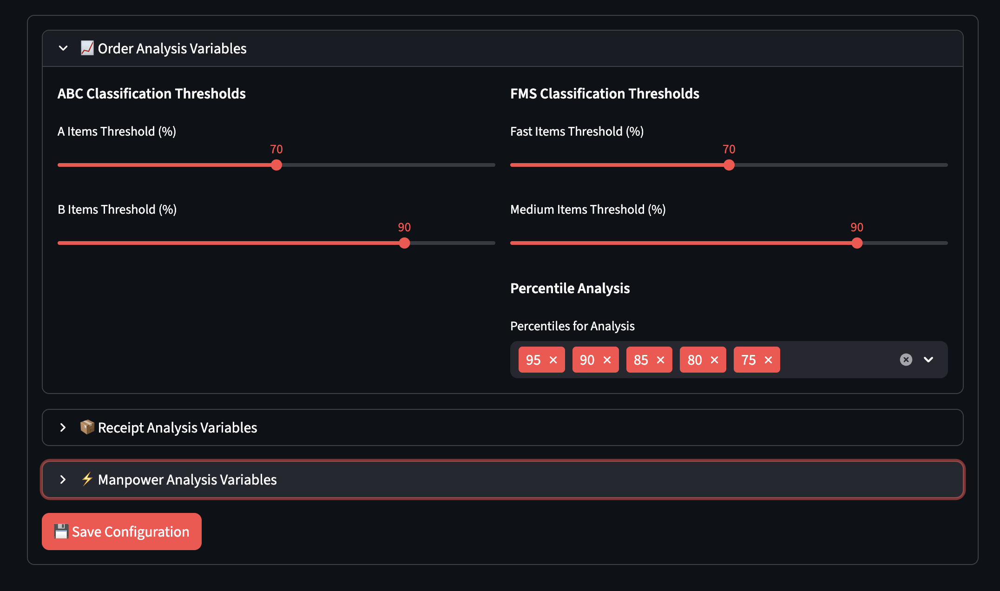
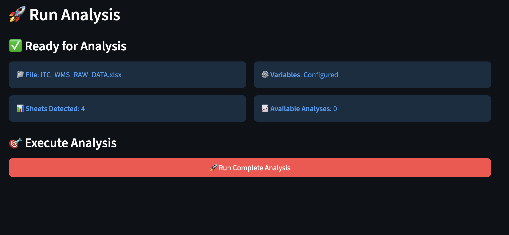
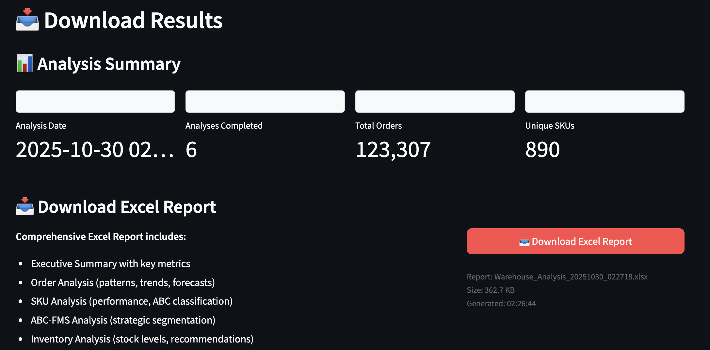

# Warehouse Analysis Tool - Quick Guide

Generate comprehensive warehouse analysis reports in 4 simple steps:

## 📁 Step 1: Upload Your Excel File

- Click "Browse files" or drag & drop your Excel file
- File must contain: OrderData, ReceiptData, InventoryData sheets
- ✅ Green checkmark shows successful validation

## ⚙️ Step 2: Configure Settings  

- Set **Case to Each** conversion factors
- Default: 12 eaches per case (adjust if needed)
- Other settings auto-configured

## 🚀 Step 3: Run Analysis

- Click the blue **"Run Analysis"** button
- Processing takes ~30 seconds
- Progress bar shows completion status

## 📥 Step 4: Download Report

- Click **"📥 Download Excel Report"** button
- Report includes 10+ sheets with charts:
  - Order Analysis with trend charts
  - Receipt Analysis with volume charts  
  - SKU Analysis (ABC, FMS classification)
  - Inventory Analysis with aging
  - Raw Data Summary

---

### 🧪 Test Run
**Sample Data**: Use `Test Data/ITC_WMS_RAW_DATA.xlsx` for demo

### 📊 Output Features
- **Interactive Charts**: Trend analysis, volume patterns
- **Classifications**: ABC-FMS matrix for SKU prioritization
- **Metrics**: Daily/weekly/monthly aggregations
- **Insights**: Percentile analysis, seasonality patterns

### ⚡ Quick Tips
- Ensure date formats are consistent (DD/MM/YYYY)
- Check column names match expected format
- Large files (>10MB) may take 1-2 minutes

---
**Run locally**: `streamlit run app.py`